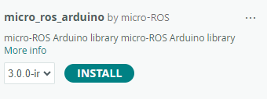
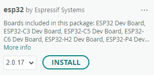

# IMU Sensor Integration with ROS

### The purpose of this program is to capture and publish IMU data using a MicroROS agent. This will publish acceleration, gyroscopic, and quaternion data to the corresponding ROS topic.

## Hardware
* [ESP32 WROOM-DA](https://www.microcenter.com/product/704603/ESP-32_Development_Board_-_3_Pack?storeID=055)
* [MPU9250](https://www.amazon.com/HiLetgo-Gyroscope-Acceleration-Accelerator-Magnetometer/dp/B01I1J0Z7Y?dib=eyJ2IjoiMSJ9.fUaDsdk9ALrJjJHvWeki0O9GjuGqYNZpqKBl81hCfjrQNqjzhNDUq1RNpm8rT9O7ETkksLc-OUFAHWUG6UER13_GUlZHZLweY_9Gijs-JfzXlsn2y1giVg0dFD-7S6LW5TRDGy6bEcKNemPhx6fER4URHJL7QZk2WkVwgJ6FGKfJQLmjTvgKUMAkU_VSja3Z32x_kFzfT6Dahr_WVAwooN9XndEO6EtxI_cVUy90W6E.O6vUDc74jMMQvZnDRfpBdqee4oCUenk58OZWEF1Ffy8&dib_tag=se&keywords=mpu9250&qid=1773161136&sr=8-5&th=1)

## Software setup
### Micro ROS agent
First, go to the scripts directory in the repository.
``` 
cd ../ESP32_IMU_Micro_ROS/scripts
```

Then to build the micro ROS agent, run the following shell script:
``` 
cd ./setup_microros_ws.sh
```

When the building process has finished, the host computer is setup to run the micro ROS agent.

### Installing micro ROS arduino library
In the Arduino IDE library manager, search for `micro_ros_arduino`. It should show the following:

)

### Using proper ESP32 board library version

There is a bug in the micro ROS arduino library that limits the refresh rate the agent updates the topic. In order to fix this, the ESP32 board library version needs to be downgraded to `2.0.17`




## Executing program
Upload the follwoing program to the ESP32 in the Arduino IDE.
``` 
ESP32_Micro_ROS.ino
```

Then, execute the `run_microros.sh` script.

The ESP will continue to retry the connection while the agent is inactive.

*If the agent doesn't connect, reset the ESP32*

__To view the data that is being published to the ROS topic, execute the following command__
```
ros2 topic echo imu
```


IMU data should be updating in the echo terminal window.
